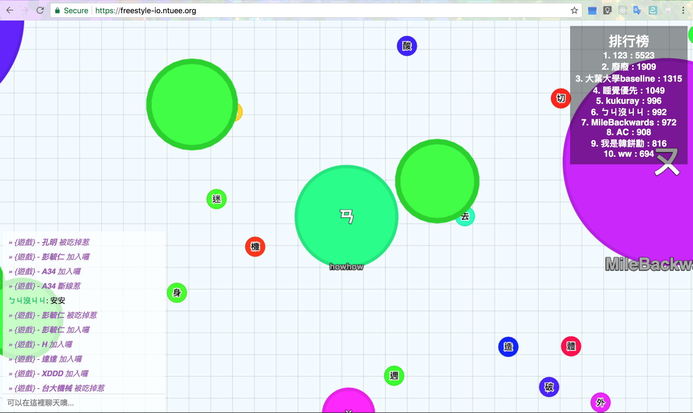
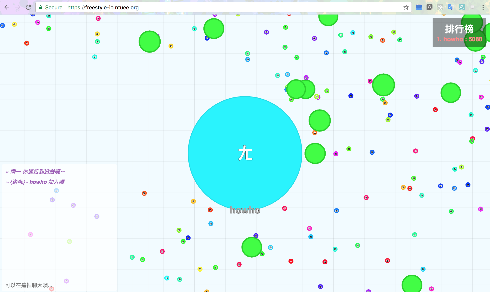
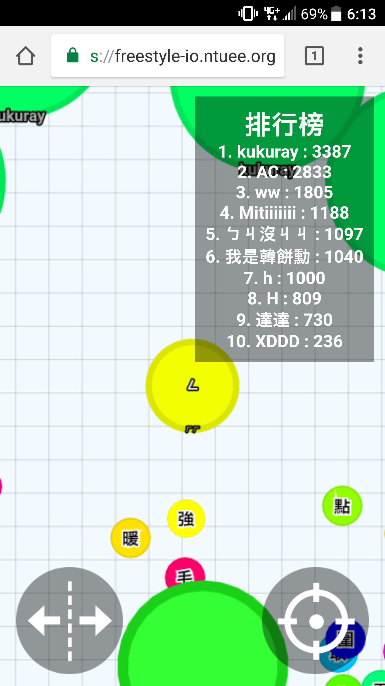

# 2017 台大電機週網頁遊戲 frEEstyle
https://freestyle-io.ntuee.org/

本遊戲以[agar.io-clone](https://github.com/huytd/agar.io-clone)為模板，加上[2017台大電機週frEEstyle](https://www.facebook.com/2017-%E5%8F%B0%E5%A4%A7%E9%9B%BB%E6%A9%9F%E9%80%B1-free-style-1132875553513949/)的主題元素所改造而成。

由於原模板的程式碼本來就不是很易於閱讀，我們也沒有太多時間修改架構，所以本程式碼很醜不易維護ＱＱ。除非有重大bug影響遊戲進行，我們不會再維護此專案。

We will no longer maintain this project unless there are serious bugs.

遊戲截圖：

## Contributors
[HowardMHJuan](https://github.com/HowardMHJuan)
[ByronHsu](https://github.com/ByronHsu)
[han0110](https://github.com/han0110)